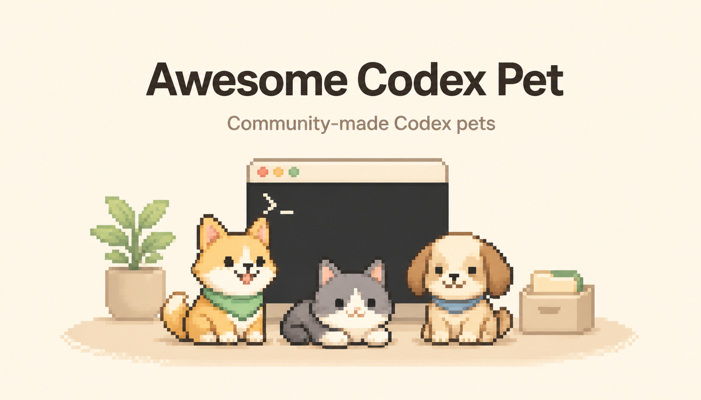

<div align="center">

# Awesome Codex Pet

[简体中文](./docs/zh-CN/README.md) | English

      [](https://github.com/legeling/awesome-codex-pet/actions/workflows/pet-previews.yml)

[**🌐 Live gallery**](https://awesome-codex-pet.pages.dev) · [**⚡ Install guide**](https://awesome-codex-pet.pages.dev/install) · [**📖 Submit a pet**](https://awesome-codex-pet.pages.dev/guide)



</div>

A curated gallery of community-made Codex pets. Browse animations on the [website](https://awesome-codex-pet.pages.dev), install with one command, and submit your own pet through GitHub.

## Highlights

- **One-command install** — no clone, no manual setup, works on macOS / Linux / Windows
- **Live gallery** — animated previews, filtering, and view/install counters at [awesome-codex-pet.pages.dev](https://awesome-codex-pet.pages.dev)
- **GitHub-native submissions** — open an issue or PR, the rest is automated
- **Open licensing** — code under MIT, pet assets under CC BY-NC 4.0

Each pet is a small shareable package:

```text
pets/<pet-slug>--<author-slug>/
├── submission.json
├── pet.json
└── spritesheet.webp
```

Preview images are generated into `assets/previews/<pet-id>/` as local or CI build output, never inside the pet folder.

## Quick Install

No clone required. Pick the script for your shell:

```bash
# macOS / Linux
curl -fsSL https://raw.githubusercontent.com/legeling/awesome-codex-pet/main/scripts/install-pet.sh | bash -s -- firefly--lingxiaotian
```

```powershell
# Windows PowerShell
powershell -NoProfile -ExecutionPolicy Bypass -Command "iwr -UseB https://raw.githubusercontent.com/legeling/awesome-codex-pet/main/scripts/install-pet.ps1 | iex; Install-CodexPet firefly--lingxiaotian"
```

```bash
# Anywhere with Node.js
npx awesome-codex-pet firefly--lingxiaotian
```

List available pets:

```bash
curl -fsSL https://raw.githubusercontent.com/legeling/awesome-codex-pet/main/scripts/install-pet.sh | bash -s -- --list
```

Default install locations:

- macOS / Linux: `~/.codex/pets/<pet-id>/`
- Windows: `%USERPROFILE%\.codex\pets\<pet-id>\`

Set `CODEX_HOME` to override, or `AWESOME_CODEX_PET_NO_STATS=1` to opt out of anonymous install counters.

## Pets

### Anime Characters

<table>
<tr><th>Name</th><td colspan="5"><a href="./pets/firefly--lingxiaotian">Firefly</a> · by <a href="https://github.com/legeling">@legeling</a> · Anime Characters</td></tr>
<tr><th>Install</th><td colspan="5"><code>curl -fsSL https://raw.githubusercontent.com/legeling/awesome-codex-pet/main/scripts/install-pet.sh | bash -s -- firefly--lingxiaotian</code></td></tr>
<tr><th>Action</th><td><strong>Idle</strong></td><td><strong>Waving</strong></td><td><strong>Running</strong></td><td><strong>Waiting</strong></td><td><strong>Review</strong></td></tr>
<tr><th>Preview</th><td></td><td></td><td></td><td></td><td></td></tr>
</table>

<table>
<tr><th>Name</th><td colspan="5"><a href="./pets/acheron--lingxiaotian">Acheron</a> · by <a href="https://github.com/legeling">@legeling</a> · Anime Characters</td></tr>
<tr><th>Install</th><td colspan="5"><code>curl -fsSL https://raw.githubusercontent.com/legeling/awesome-codex-pet/main/scripts/install-pet.sh | bash -s -- acheron--lingxiaotian</code></td></tr>
<tr><th>Action</th><td><strong>Idle</strong></td><td><strong>Waving</strong></td><td><strong>Running</strong></td><td><strong>Waiting</strong></td><td><strong>Review</strong></td></tr>
<tr><th>Preview</th><td></td><td></td><td></td><td></td><td></td></tr>
</table>

<table>
<tr><th>Name</th><td colspan="5"><a href="./pets/castorice--lingxiaotian">Castorice</a> · by <a href="https://github.com/legeling">@legeling</a> · Anime Characters</td></tr>
<tr><th>Install</th><td colspan="5"><code>curl -fsSL https://raw.githubusercontent.com/legeling/awesome-codex-pet/main/scripts/install-pet.sh | bash -s -- castorice--lingxiaotian</code></td></tr>
<tr><th>Action</th><td><strong>Idle</strong></td><td><strong>Waving</strong></td><td><strong>Running</strong></td><td><strong>Waiting</strong></td><td><strong>Review</strong></td></tr>
<tr><th>Preview</th><td></td><td></td><td></td><td></td><td></td></tr>
</table>

<table>
<tr><th>Name</th><td colspan="5"><a href="./pets/doro--lingxiaotian">Doro</a> · by <a href="https://github.com/legeling">@legeling</a> · Anime Characters</td></tr>
<tr><th>Install</th><td colspan="5"><code>curl -fsSL https://raw.githubusercontent.com/legeling/awesome-codex-pet/main/scripts/install-pet.sh | bash -s -- doro--lingxiaotian</code></td></tr>
<tr><th>Action</th><td><strong>Idle</strong></td><td><strong>Waving</strong></td><td><strong>Running</strong></td><td><strong>Waiting</strong></td><td><strong>Review</strong></td></tr>
<tr><th>Preview</th><td></td><td></td><td></td><td></td><td></td></tr>
</table>

<table>
<tr><th>Name</th><td colspan="5"><a href="./pets/frieren--lingxiaotian">Frieren</a> · by <a href="https://github.com/legeling">@legeling</a> · Anime Characters</td></tr>
<tr><th>Install</th><td colspan="5"><code>curl -fsSL https://raw.githubusercontent.com/legeling/awesome-codex-pet/main/scripts/install-pet.sh | bash -s -- frieren--lingxiaotian</code></td></tr>
<tr><th>Action</th><td><strong>Idle</strong></td><td><strong>Waving</strong></td><td><strong>Running</strong></td><td><strong>Waiting</strong></td><td><strong>Review</strong></td></tr>
<tr><th>Preview</th><td></td><td></td><td></td><td></td><td></td></tr>
</table>

<table>
<tr><th>Name</th><td colspan="5"><a href="./pets/furina--lingxiaotian">Furina</a> · by <a href="https://github.com/legeling">@legeling</a> · Anime Characters</td></tr>
<tr><th>Install</th><td colspan="5"><code>curl -fsSL https://raw.githubusercontent.com/legeling/awesome-codex-pet/main/scripts/install-pet.sh | bash -s -- furina--lingxiaotian</code></td></tr>
<tr><th>Action</th><td><strong>Idle</strong></td><td><strong>Waving</strong></td><td><strong>Running</strong></td><td><strong>Waiting</strong></td><td><strong>Review</strong></td></tr>
<tr><th>Preview</th><td></td><td></td><td></td><td></td><td></td></tr>
</table>

<table>
<tr><th>Name</th><td colspan="5"><a href="./pets/kamisato-ayaka--lingxiaotian">Kamisato Ayaka</a> · by <a href="https://github.com/legeling">@legeling</a> · Anime Characters</td></tr>
<tr><th>Install</th><td colspan="5"><code>curl -fsSL https://raw.githubusercontent.com/legeling/awesome-codex-pet/main/scripts/install-pet.sh | bash -s -- kamisato-ayaka--lingxiaotian</code></td></tr>
<tr><th>Action</th><td><strong>Idle</strong></td><td><strong>Waving</strong></td><td><strong>Running</strong></td><td><strong>Waiting</strong></td><td><strong>Review</strong></td></tr>
<tr><th>Preview</th><td></td><td></td><td></td><td></td><td></td></tr>
</table>

<table>
<tr><th>Name</th><td colspan="5"><a href="./pets/mahiro--lingxiaotian">Mahiro</a> · by <a href="https://github.com/legeling">@legeling</a> · Anime Characters</td></tr>
<tr><th>Install</th><td colspan="5"><code>curl -fsSL https://raw.githubusercontent.com/legeling/awesome-codex-pet/main/scripts/install-pet.sh | bash -s -- mahiro--lingxiaotian</code></td></tr>
<tr><th>Action</th><td><strong>Idle</strong></td><td><strong>Waving</strong></td><td><strong>Running</strong></td><td><strong>Waiting</strong></td><td><strong>Review</strong></td></tr>
<tr><th>Preview</th><td></td><td></td><td></td><td></td><td></td></tr>
</table>

<table>
<tr><th>Name</th><td colspan="5"><a href="./pets/mihari--hyoni1129">Mihari</a> · by <a href="https://github.com/Hyoni1129">@Hyoni1129</a> · Anime Characters</td></tr>
<tr><th>Install</th><td colspan="5"><code>curl -fsSL https://raw.githubusercontent.com/legeling/awesome-codex-pet/main/scripts/install-pet.sh | bash -s -- mihari--hyoni1129</code></td></tr>
<tr><th>Action</th><td><strong>Idle</strong></td><td><strong>Waving</strong></td><td><strong>Running</strong></td><td><strong>Waiting</strong></td><td><strong>Review</strong></td></tr>
<tr><th>Preview</th><td></td><td></td><td></td><td></td><td></td></tr>
</table>

<table>
<tr><th>Name</th><td colspan="5"><a href="./pets/mikoto--lingxiaotian">Mikoto</a> · by <a href="https://github.com/legeling">@legeling</a> · Anime Characters</td></tr>
<tr><th>Install</th><td colspan="5"><code>curl -fsSL https://raw.githubusercontent.com/legeling/awesome-codex-pet/main/scripts/install-pet.sh | bash -s -- mikoto--lingxiaotian</code></td></tr>
<tr><th>Action</th><td><strong>Idle</strong></td><td><strong>Waving</strong></td><td><strong>Running</strong></td><td><strong>Waiting</strong></td><td><strong>Review</strong></td></tr>
<tr><th>Preview</th><td></td><td></td><td></td><td></td><td></td></tr>
</table>

<table>
<tr><th>Name</th><td colspan="5"><a href="./pets/miku--lingxiaotian">Miku</a> · by <a href="https://github.com/legeling">@legeling</a> · Anime Characters</td></tr>
<tr><th>Install</th><td colspan="5"><code>curl -fsSL https://raw.githubusercontent.com/legeling/awesome-codex-pet/main/scripts/install-pet.sh | bash -s -- miku--lingxiaotian</code></td></tr>
<tr><th>Action</th><td><strong>Idle</strong></td><td><strong>Waving</strong></td><td><strong>Running</strong></td><td><strong>Waiting</strong></td><td><strong>Review</strong></td></tr>
<tr><th>Preview</th><td></td><td></td><td></td><td></td><td></td></tr>
</table>

<table>
<tr><th>Name</th><td colspan="5"><a href="./pets/nahida--lingxiaotian">Nahida</a> · by <a href="https://github.com/legeling">@legeling</a> · Anime Characters</td></tr>
<tr><th>Install</th><td colspan="5"><code>curl -fsSL https://raw.githubusercontent.com/legeling/awesome-codex-pet/main/scripts/install-pet.sh | bash -s -- nahida--lingxiaotian</code></td></tr>
<tr><th>Action</th><td><strong>Idle</strong></td><td><strong>Waving</strong></td><td><strong>Running</strong></td><td><strong>Waiting</strong></td><td><strong>Review</strong></td></tr>
<tr><th>Preview</th><td></td><td></td><td></td><td></td><td></td></tr>
</table>

<table>
<tr><th>Name</th><td colspan="5"><a href="./pets/paimon--lingxiaotian">Paimon</a> · by <a href="https://github.com/legeling">@legeling</a> · Anime Characters</td></tr>
<tr><th>Install</th><td colspan="5"><code>curl -fsSL https://raw.githubusercontent.com/legeling/awesome-codex-pet/main/scripts/install-pet.sh | bash -s -- paimon--lingxiaotian</code></td></tr>
<tr><th>Action</th><td><strong>Idle</strong></td><td><strong>Waving</strong></td><td><strong>Running</strong></td><td><strong>Waiting</strong></td><td><strong>Review</strong></td></tr>
<tr><th>Preview</th><td></td><td></td><td></td><td></td><td></td></tr>
</table>

<table>
<tr><th>Name</th><td colspan="5"><a href="./pets/raiden-shogun--lingxiaotian">Raiden Shogun</a> · by <a href="https://github.com/legeling">@legeling</a> · Anime Characters</td></tr>
<tr><th>Install</th><td colspan="5"><code>curl -fsSL https://raw.githubusercontent.com/legeling/awesome-codex-pet/main/scripts/install-pet.sh | bash -s -- raiden-shogun--lingxiaotian</code></td></tr>
<tr><th>Action</th><td><strong>Idle</strong></td><td><strong>Waving</strong></td><td><strong>Running</strong></td><td><strong>Waiting</strong></td><td><strong>Review</strong></td></tr>
<tr><th>Preview</th><td></td><td></td><td></td><td></td><td></td></tr>
</table>

<table>
<tr><th>Name</th><td colspan="5"><a href="./pets/reimu--lingxiaotian">Reimu</a> · by <a href="https://github.com/legeling">@legeling</a> · Anime Characters</td></tr>
<tr><th>Install</th><td colspan="5"><code>curl -fsSL https://raw.githubusercontent.com/legeling/awesome-codex-pet/main/scripts/install-pet.sh | bash -s -- reimu--lingxiaotian</code></td></tr>
<tr><th>Action</th><td><strong>Idle</strong></td><td><strong>Waving</strong></td><td><strong>Running</strong></td><td><strong>Waiting</strong></td><td><strong>Review</strong></td></tr>
<tr><th>Preview</th><td></td><td></td><td></td><td></td><td></td></tr>
</table>

<table>
<tr><th>Name</th><td colspan="5"><a href="./pets/robin--lingxiaotian">Robin</a> · by <a href="https://github.com/legeling">@legeling</a> · Anime Characters</td></tr>
<tr><th>Install</th><td colspan="5"><code>curl -fsSL https://raw.githubusercontent.com/legeling/awesome-codex-pet/main/scripts/install-pet.sh | bash -s -- robin--lingxiaotian</code></td></tr>
<tr><th>Action</th><td><strong>Idle</strong></td><td><strong>Waving</strong></td><td><strong>Running</strong></td><td><strong>Waiting</strong></td><td><strong>Review</strong></td></tr>
<tr><th>Preview</th><td></td><td></td><td></td><td></td><td></td></tr>
</table>

<table>
<tr><th>Name</th><td colspan="5"><a href="./pets/ruan-mei--lingxiaotian">Ruan Mei</a> · by <a href="https://github.com/legeling">@legeling</a> · Anime Characters</td></tr>
<tr><th>Install</th><td colspan="5"><code>curl -fsSL https://raw.githubusercontent.com/legeling/awesome-codex-pet/main/scripts/install-pet.sh | bash -s -- ruan-mei--lingxiaotian</code></td></tr>
<tr><th>Action</th><td><strong>Idle</strong></td><td><strong>Waving</strong></td><td><strong>Running</strong></td><td><strong>Waiting</strong></td><td><strong>Review</strong></td></tr>
<tr><th>Preview</th><td></td><td></td><td></td><td></td><td></td></tr>
</table>

<table>
<tr><th>Name</th><td colspan="5"><a href="./pets/sparkle--lingxiaotian">Sparkle</a> · by <a href="https://github.com/legeling">@legeling</a> · Anime Characters</td></tr>
<tr><th>Install</th><td colspan="5"><code>curl -fsSL https://raw.githubusercontent.com/legeling/awesome-codex-pet/main/scripts/install-pet.sh | bash -s -- sparkle--lingxiaotian</code></td></tr>
<tr><th>Action</th><td><strong>Idle</strong></td><td><strong>Waving</strong></td><td><strong>Running</strong></td><td><strong>Waiting</strong></td><td><strong>Review</strong></td></tr>
<tr><th>Preview</th><td></td><td></td><td></td><td></td><td></td></tr>
</table>

<table>
<tr><th>Name</th><td colspan="5"><a href="./pets/tingyun--lingxiaotian">Tingyun</a> · by <a href="https://github.com/legeling">@legeling</a> · Anime Characters</td></tr>
<tr><th>Install</th><td colspan="5"><code>curl -fsSL https://raw.githubusercontent.com/legeling/awesome-codex-pet/main/scripts/install-pet.sh | bash -s -- tingyun--lingxiaotian</code></td></tr>
<tr><th>Action</th><td><strong>Idle</strong></td><td><strong>Waving</strong></td><td><strong>Running</strong></td><td><strong>Waiting</strong></td><td><strong>Review</strong></td></tr>
<tr><th>Preview</th><td></td><td></td><td></td><td></td><td></td></tr>
</table>

<table>
<tr><th>Name</th><td colspan="5"><a href="./pets/dnf-female-ammo--qunboo">女弹药Q</a> · by <a href="https://github.com/QunBoo">@QunBoo</a> · Anime Characters</td></tr>
<tr><th>Install</th><td colspan="5"><code>curl -fsSL https://raw.githubusercontent.com/legeling/awesome-codex-pet/main/scripts/install-pet.sh | bash -s -- dnf-female-ammo--qunboo</code></td></tr>
<tr><th>Action</th><td><strong>Idle</strong></td><td><strong>Waving</strong></td><td><strong>Running</strong></td><td><strong>Waiting</strong></td><td><strong>Review</strong></td></tr>
<tr><th>Preview</th><td></td><td></td><td></td><td></td><td></td></tr>
</table>

<table>
<tr><th>Name</th><td colspan="5"><a href="./pets/bocchi--lingxiaotian">Bocchi</a> · by <a href="https://github.com/legeling">@legeling</a> · Anime Characters</td></tr>
<tr><th>Install</th><td colspan="5"><code>curl -fsSL https://raw.githubusercontent.com/legeling/awesome-codex-pet/main/scripts/install-pet.sh | bash -s -- bocchi--lingxiaotian</code></td></tr>
<tr><th>Action</th><td><strong>Idle</strong></td><td><strong>Waving</strong></td><td><strong>Running</strong></td><td><strong>Waiting</strong></td><td><strong>Review</strong></td></tr>
<tr><th>Preview</th><td></td><td></td><td></td><td></td><td></td></tr>
</table>

### Original Characters

<table>
<tr><th>Name</th><td colspan="5"><a href="./pets/aemeath-mini--cunuo">Aemeath Mini</a> · by <a href="https://github.com/cuNuo">@cuNuo</a> · Original Characters</td></tr>
<tr><th>Install</th><td colspan="5"><code>curl -fsSL https://raw.githubusercontent.com/legeling/awesome-codex-pet/main/scripts/install-pet.sh | bash -s -- aemeath-mini--cunuo</code></td></tr>
<tr><th>Action</th><td><strong>Idle</strong></td><td><strong>Waving</strong></td><td><strong>Running</strong></td><td><strong>Waiting</strong></td><td><strong>Review</strong></td></tr>
<tr><th>Preview</th><td></td><td></td><td></td><td></td><td></td></tr>
</table>

<table>
<tr><th>Name</th><td colspan="5"><a href="./pets/apu--xchangee">Apu</a> · by <a href="https://github.com/xchangee">@xchangee</a> · Original Characters</td></tr>
<tr><th>Install</th><td colspan="5"><code>curl -fsSL https://raw.githubusercontent.com/legeling/awesome-codex-pet/main/scripts/install-pet.sh | bash -s -- apu--xchangee</code></td></tr>
<tr><th>Action</th><td><strong>Idle</strong></td><td><strong>Waving</strong></td><td><strong>Running</strong></td><td><strong>Waiting</strong></td><td><strong>Review</strong></td></tr>
<tr><th>Preview</th><td></td><td></td><td></td><td></td><td></td></tr>
</table>

<table>
<tr><th>Name</th><td colspan="5"><a href="./pets/claude--xiangking">Claude</a> · by <a href="https://github.com/xiangking">@xiangking</a> · Original Characters</td></tr>
<tr><th>Install</th><td colspan="5"><code>curl -fsSL https://raw.githubusercontent.com/legeling/awesome-codex-pet/main/scripts/install-pet.sh | bash -s -- claude--xiangking</code></td></tr>
<tr><th>Action</th><td><strong>Idle</strong></td><td><strong>Waving</strong></td><td><strong>Running</strong></td><td><strong>Waiting</strong></td><td><strong>Review</strong></td></tr>
<tr><th>Preview</th><td></td><td></td><td></td><td></td><td></td></tr>
</table>

<table>
<tr><th>Name</th><td colspan="5"><a href="./pets/diaoyi-baobao--d1a0y1bb">Diaoyi Baobao</a> · by <a href="https://github.com/D1a0y1bb">@D1a0y1bb</a> · Original Characters</td></tr>
<tr><th>Install</th><td colspan="5"><code>curl -fsSL https://raw.githubusercontent.com/legeling/awesome-codex-pet/main/scripts/install-pet.sh | bash -s -- diaoyi-baobao--d1a0y1bb</code></td></tr>
<tr><th>Action</th><td><strong>Idle</strong></td><td><strong>Waving</strong></td><td><strong>Running</strong></td><td><strong>Waiting</strong></td><td><strong>Review</strong></td></tr>
<tr><th>Preview</th><td></td><td></td><td></td><td></td><td></td></tr>
</table>

<table>
<tr><th>Name</th><td colspan="5"><a href="./pets/hajimi--zeyuwang1999">Hajimi</a> · by <a href="https://github.com/zeyuwang1999">@zeyuwang1999</a> · Original Characters</td></tr>
<tr><th>Install</th><td colspan="5"><code>curl -fsSL https://raw.githubusercontent.com/legeling/awesome-codex-pet/main/scripts/install-pet.sh | bash -s -- hajimi--zeyuwang1999</code></td></tr>
<tr><th>Action</th><td><strong>Idle</strong></td><td><strong>Waving</strong></td><td><strong>Running</strong></td><td><strong>Waiting</strong></td><td><strong>Review</strong></td></tr>
<tr><th>Preview</th><td></td><td></td><td></td><td></td><td></td></tr>
</table>

<table>
<tr><th>Name</th><td colspan="5"><a href="./pets/hana2--initiatione">Hana2</a> · by <a href="https://github.com/initiatione">@initiatione</a> · Original Characters</td></tr>
<tr><th>Install</th><td colspan="5"><code>curl -fsSL https://raw.githubusercontent.com/legeling/awesome-codex-pet/main/scripts/install-pet.sh | bash -s -- hana2--initiatione</code></td></tr>
<tr><th>Action</th><td><strong>Idle</strong></td><td><strong>Waving</strong></td><td><strong>Running</strong></td><td><strong>Waiting</strong></td><td><strong>Review</strong></td></tr>
<tr><th>Preview</th><td></td><td></td><td></td><td></td><td></td></tr>
</table>

<table>
<tr><th>Name</th><td colspan="5"><a href="./pets/lulu--yogazz">Lulu</a> · by <a href="https://github.com/YoGazz">@YoGazz</a> · Original Characters</td></tr>
<tr><th>Install</th><td colspan="5"><code>curl -fsSL https://raw.githubusercontent.com/legeling/awesome-codex-pet/main/scripts/install-pet.sh | bash -s -- lulu--yogazz</code></td></tr>
<tr><th>Action</th><td><strong>Idle</strong></td><td><strong>Waving</strong></td><td><strong>Running</strong></td><td><strong>Waiting</strong></td><td><strong>Review</strong></td></tr>
<tr><th>Preview</th><td></td><td></td><td></td><td></td><td></td></tr>
</table>

<table>
<tr><th>Name</th><td colspan="5"><a href="./pets/mika--rotl24">Mika</a> · by <a href="https://github.com/ROTl24">@ROTl24</a> · Original Characters</td></tr>
<tr><th>Install</th><td colspan="5"><code>curl -fsSL https://raw.githubusercontent.com/legeling/awesome-codex-pet/main/scripts/install-pet.sh | bash -s -- mika--rotl24</code></td></tr>
<tr><th>Action</th><td><strong>Idle</strong></td><td><strong>Waving</strong></td><td><strong>Running</strong></td><td><strong>Waiting</strong></td><td><strong>Review</strong></td></tr>
<tr><th>Preview</th><td></td><td></td><td></td><td></td><td></td></tr>
</table>

<table>
<tr><th>Name</th><td colspan="5"><a href="./pets/night-neko--netizenxuan">Night Neko</a> · by <a href="https://github.com/netizenXuan">@netizenXuan</a> · Original Characters</td></tr>
<tr><th>Install</th><td colspan="5"><code>curl -fsSL https://raw.githubusercontent.com/legeling/awesome-codex-pet/main/scripts/install-pet.sh | bash -s -- night-neko--netizenxuan</code></td></tr>
<tr><th>Action</th><td><strong>Idle</strong></td><td><strong>Waving</strong></td><td><strong>Running</strong></td><td><strong>Waiting</strong></td><td><strong>Review</strong></td></tr>
<tr><th>Preview</th><td></td><td></td><td></td><td></td><td></td></tr>
</table>

<table>
<tr><th>Name</th><td colspan="5"><a href="./pets/ruruka--ltmcliao-cmyk">RuRuKa</a> · by <a href="https://github.com/ltmcliao-cmyk">@ltmcliao-cmyk</a> · Original Characters</td></tr>
<tr><th>Install</th><td colspan="5"><code>curl -fsSL https://raw.githubusercontent.com/legeling/awesome-codex-pet/main/scripts/install-pet.sh | bash -s -- ruruka--ltmcliao-cmyk</code></td></tr>
<tr><th>Action</th><td><strong>Idle</strong></td><td><strong>Waving</strong></td><td><strong>Running</strong></td><td><strong>Waiting</strong></td><td><strong>Review</strong></td></tr>
<tr><th>Preview</th><td></td><td></td><td></td><td></td><td></td></tr>
</table>

<table>
<tr><th>Name</th><td colspan="5"><a href="./pets/saki--rookie-09">Saki</a> · by <a href="https://github.com/rookie-09">@rookie-09</a> · Original Characters</td></tr>
<tr><th>Install</th><td colspan="5"><code>curl -fsSL https://raw.githubusercontent.com/legeling/awesome-codex-pet/main/scripts/install-pet.sh | bash -s -- saki--rookie-09</code></td></tr>
<tr><th>Action</th><td><strong>Idle</strong></td><td><strong>Waving</strong></td><td><strong>Running</strong></td><td><strong>Waiting</strong></td><td><strong>Review</strong></td></tr>
<tr><th>Preview</th><td></td><td></td><td></td><td></td><td></td></tr>
</table>

<table>
<tr><th>Name</th><td colspan="5"><a href="./pets/shian-helper--mistyshen">Shian</a> · by <a href="https://github.com/mistyShen">@mistyShen</a> · Original Characters</td></tr>
<tr><th>Install</th><td colspan="5"><code>curl -fsSL https://raw.githubusercontent.com/legeling/awesome-codex-pet/main/scripts/install-pet.sh | bash -s -- shian-helper--mistyshen</code></td></tr>
<tr><th>Action</th><td><strong>Idle</strong></td><td><strong>Waving</strong></td><td><strong>Running</strong></td><td><strong>Waiting</strong></td><td><strong>Review</strong></td></tr>
<tr><th>Preview</th><td></td><td></td><td></td><td></td><td></td></tr>
</table>

<table>
<tr><th>Name</th><td colspan="5"><a href="./pets/wally--wally025">Wally</a> · by <a href="https://github.com/wally025">@wally025</a> · Original Characters</td></tr>
<tr><th>Install</th><td colspan="5"><code>curl -fsSL https://raw.githubusercontent.com/legeling/awesome-codex-pet/main/scripts/install-pet.sh | bash -s -- wally--wally025</code></td></tr>
<tr><th>Action</th><td><strong>Idle</strong></td><td><strong>Waving</strong></td><td><strong>Running</strong></td><td><strong>Waiting</strong></td><td><strong>Review</strong></td></tr>
<tr><th>Preview</th><td></td><td></td><td></td><td></td><td></td></tr>
</table>

<table>
<tr><th>Name</th><td colspan="5"><a href="./pets/xian-xiao-lu--qingyunagi">Xian Xiao Lu</a> · by <a href="https://github.com/qingyunAGI">@qingyunAGI</a> · Original Characters</td></tr>
<tr><th>Install</th><td colspan="5"><code>curl -fsSL https://raw.githubusercontent.com/legeling/awesome-codex-pet/main/scripts/install-pet.sh | bash -s -- xian-xiao-lu--qingyunagi</code></td></tr>
<tr><th>Action</th><td><strong>Idle</strong></td><td><strong>Waving</strong></td><td><strong>Running</strong></td><td><strong>Waiting</strong></td><td><strong>Review</strong></td></tr>
<tr><th>Preview</th><td></td><td></td><td></td><td></td><td></td></tr>
</table>

<table>
<tr><th>Name</th><td colspan="5"><a href="./pets/yier--gbn666">Yi Er</a> · by <a href="https://github.com/gbn666">@gbn666</a> · Original Characters</td></tr>
<tr><th>Install</th><td colspan="5"><code>curl -fsSL https://raw.githubusercontent.com/legeling/awesome-codex-pet/main/scripts/install-pet.sh | bash -s -- yier--gbn666</code></td></tr>
<tr><th>Action</th><td><strong>Idle</strong></td><td><strong>Waving</strong></td><td><strong>Running</strong></td><td><strong>Waiting</strong></td><td><strong>Review</strong></td></tr>
<tr><th>Preview</th><td></td><td></td><td></td><td></td><td></td></tr>
</table>

<table>
<tr><th>Name</th><td colspan="5"><a href="./pets/yuanzai--gaming33">Yuanzai</a> · by <a href="https://github.com/Gaming33">@Gaming33</a> · Original Characters</td></tr>
<tr><th>Install</th><td colspan="5"><code>curl -fsSL https://raw.githubusercontent.com/legeling/awesome-codex-pet/main/scripts/install-pet.sh | bash -s -- yuanzai--gaming33</code></td></tr>
<tr><th>Action</th><td><strong>Idle</strong></td><td><strong>Waving</strong></td><td><strong>Running</strong></td><td><strong>Waiting</strong></td><td><strong>Review</strong></td></tr>
<tr><th>Preview</th><td></td><td></td><td></td><td></td><td></td></tr>
</table>

<table>
<tr><th>Name</th><td colspan="5"><a href="./pets/yuzubou--keseras34938976">Yuzubou</a> · by <a href="https://github.com/Keseras34938976">@Keseras34938976</a> · Original Characters</td></tr>
<tr><th>Install</th><td colspan="5"><code>curl -fsSL https://raw.githubusercontent.com/legeling/awesome-codex-pet/main/scripts/install-pet.sh | bash -s -- yuzubou--keseras34938976</code></td></tr>
<tr><th>Action</th><td><strong>Idle</strong></td><td><strong>Waving</strong></td><td><strong>Running</strong></td><td><strong>Waiting</strong></td><td><strong>Review</strong></td></tr>
<tr><th>Preview</th><td></td><td></td><td></td><td></td><td></td></tr>
</table>

### Memes

<table>
<tr><th>Name</th><td colspan="5"><a href="./pets/katana-cheems--thankyou-cheems">Katana Cheems</a> · by <a href="https://github.com/Thankyou-Cheems">@Thankyou-Cheems</a> · Memes</td></tr>
<tr><th>Install</th><td colspan="5"><code>curl -fsSL https://raw.githubusercontent.com/legeling/awesome-codex-pet/main/scripts/install-pet.sh | bash -s -- katana-cheems--thankyou-cheems</code></td></tr>
<tr><th>Action</th><td><strong>Idle</strong></td><td><strong>Waving</strong></td><td><strong>Running</strong></td><td><strong>Waiting</strong></td><td><strong>Review</strong></td></tr>
<tr><th>Preview</th><td></td><td></td><td></td><td></td><td></td></tr>
</table>

### Animals

<table>
<tr><th>Name</th><td colspan="5"><a href="./pets/becky--natewanggg">Becky</a> · by <a href="https://github.com/NateWanggg">@NateWanggg</a> · Animals</td></tr>
<tr><th>Install</th><td colspan="5"><code>curl -fsSL https://raw.githubusercontent.com/legeling/awesome-codex-pet/main/scripts/install-pet.sh | bash -s -- becky--natewanggg</code></td></tr>
<tr><th>Action</th><td><strong>Idle</strong></td><td><strong>Waving</strong></td><td><strong>Running</strong></td><td><strong>Waiting</strong></td><td><strong>Review</strong></td></tr>
<tr><th>Preview</th><td></td><td></td><td></td><td></td><td></td></tr>
</table>

<table>
<tr><th>Name</th><td colspan="5"><a href="./pets/bubu--gbn666">Bubu</a> · by <a href="https://github.com/gbn666">@gbn666</a> · Animals</td></tr>
<tr><th>Install</th><td colspan="5"><code>curl -fsSL https://raw.githubusercontent.com/legeling/awesome-codex-pet/main/scripts/install-pet.sh | bash -s -- bubu--gbn666</code></td></tr>
<tr><th>Action</th><td><strong>Idle</strong></td><td><strong>Waving</strong></td><td><strong>Running</strong></td><td><strong>Waiting</strong></td><td><strong>Review</strong></td></tr>
<tr><th>Preview</th><td></td><td></td><td></td><td></td><td></td></tr>
</table>

<table>
<tr><th>Name</th><td colspan="5"><a href="./pets/corgi-companion--cxian0928-afk">Corgi Companion</a> · by <a href="https://github.com/cxian0928-afk">@cxian0928-afk</a> · Animals</td></tr>
<tr><th>Install</th><td colspan="5"><code>curl -fsSL https://raw.githubusercontent.com/legeling/awesome-codex-pet/main/scripts/install-pet.sh | bash -s -- corgi-companion--cxian0928-afk</code></td></tr>
<tr><th>Action</th><td><strong>Idle</strong></td><td><strong>Waving</strong></td><td><strong>Running</strong></td><td><strong>Waiting</strong></td><td><strong>Review</strong></td></tr>
<tr><th>Preview</th><td></td><td></td><td></td><td></td><td></td></tr>
</table>

<table>
<tr><th>Name</th><td colspan="5"><a href="./pets/diandian--lllucasxu">Diandian</a> · by <a href="https://github.com/LLLucasXU">@LLLucasXU</a> · Animals</td></tr>
<tr><th>Install</th><td colspan="5"><code>curl -fsSL https://raw.githubusercontent.com/legeling/awesome-codex-pet/main/scripts/install-pet.sh | bash -s -- diandian--lllucasxu</code></td></tr>
<tr><th>Action</th><td><strong>Idle</strong></td><td><strong>Waving</strong></td><td><strong>Running</strong></td><td><strong>Waiting</strong></td><td><strong>Review</strong></td></tr>
<tr><th>Preview</th><td></td><td></td><td></td><td></td><td></td></tr>
</table>

<table>
<tr><th>Name</th><td colspan="5"><a href="./pets/fleta--natewanggg">Fleta</a> · by <a href="https://github.com/NateWanggg">@NateWanggg</a> · Animals</td></tr>
<tr><th>Install</th><td colspan="5"><code>curl -fsSL https://raw.githubusercontent.com/legeling/awesome-codex-pet/main/scripts/install-pet.sh | bash -s -- fleta--natewanggg</code></td></tr>
<tr><th>Action</th><td><strong>Idle</strong></td><td><strong>Waving</strong></td><td><strong>Running</strong></td><td><strong>Waiting</strong></td><td><strong>Review</strong></td></tr>
<tr><th>Preview</th><td></td><td></td><td></td><td></td><td></td></tr>
</table>

<table>
<tr><th>Name</th><td colspan="5"><a href="./pets/frankie--aygunvarol">Frankie</a> · by <a href="https://github.com/AygunVarol">@AygunVarol</a> · Animals</td></tr>
<tr><th>Install</th><td colspan="5"><code>curl -fsSL https://raw.githubusercontent.com/legeling/awesome-codex-pet/main/scripts/install-pet.sh | bash -s -- frankie--aygunvarol</code></td></tr>
<tr><th>Action</th><td><strong>Idle</strong></td><td><strong>Waving</strong></td><td><strong>Running</strong></td><td><strong>Waiting</strong></td><td><strong>Review</strong></td></tr>
<tr><th>Preview</th><td></td><td></td><td></td><td></td><td></td></tr>
</table>

<table>
<tr><th>Name</th><td colspan="5"><a href="./pets/little-sheep--mingdong">Little Sheep</a> · by @MingDong · Animals</td></tr>
<tr><th>Install</th><td colspan="5"><code>curl -fsSL https://raw.githubusercontent.com/legeling/awesome-codex-pet/main/scripts/install-pet.sh | bash -s -- little-sheep--mingdong</code></td></tr>
<tr><th>Action</th><td><strong>Idle</strong></td><td><strong>Waving</strong></td><td><strong>Running</strong></td><td><strong>Waiting</strong></td><td><strong>Review</strong></td></tr>
<tr><th>Preview</th><td></td><td></td><td></td><td></td><td></td></tr>
</table>

<table>
<tr><th>Name</th><td colspan="5"><a href="./pets/mai--dwdestiny">Mai</a> · by <a href="https://github.com/DwDestiny">@DwDestiny</a> · Animals</td></tr>
<tr><th>Install</th><td colspan="5"><code>curl -fsSL https://raw.githubusercontent.com/legeling/awesome-codex-pet/main/scripts/install-pet.sh | bash -s -- mai--dwdestiny</code></td></tr>
<tr><th>Action</th><td><strong>Idle</strong></td><td><strong>Waving</strong></td><td><strong>Running</strong></td><td><strong>Waiting</strong></td><td><strong>Review</strong></td></tr>
<tr><th>Preview</th><td></td><td></td><td></td><td></td><td></td></tr>
</table>

<table>
<tr><th>Name</th><td colspan="5"><a href="./pets/mimi--spacebody">Mimi</a> · by <a href="https://github.com/Spacebody">@Spacebody</a> · Animals</td></tr>
<tr><th>Install</th><td colspan="5"><code>curl -fsSL https://raw.githubusercontent.com/legeling/awesome-codex-pet/main/scripts/install-pet.sh | bash -s -- mimi--spacebody</code></td></tr>
<tr><th>Action</th><td><strong>Idle</strong></td><td><strong>Waving</strong></td><td><strong>Running</strong></td><td><strong>Waiting</strong></td><td><strong>Review</strong></td></tr>
<tr><th>Preview</th><td></td><td></td><td></td><td></td><td></td></tr>
</table>

<table>
<tr><th>Name</th><td colspan="5"><a href="./pets/panda--jason-bai">Panda</a> · by <a href="https://github.com/Jason-Bai">@Jason-Bai</a> · Animals</td></tr>
<tr><th>Install</th><td colspan="5"><code>curl -fsSL https://raw.githubusercontent.com/legeling/awesome-codex-pet/main/scripts/install-pet.sh | bash -s -- panda--jason-bai</code></td></tr>
<tr><th>Action</th><td><strong>Idle</strong></td><td><strong>Waving</strong></td><td><strong>Running</strong></td><td><strong>Waiting</strong></td><td><strong>Review</strong></td></tr>
<tr><th>Preview</th><td></td><td></td><td></td><td></td><td></td></tr>
</table>

<table>
<tr><th>Name</th><td colspan="5"><a href="./pets/teddy--danieloleary">Teddy</a> · by <a href="https://github.com/danieloleary">@danieloleary</a> · Animals</td></tr>
<tr><th>Install</th><td colspan="5"><code>curl -fsSL https://raw.githubusercontent.com/legeling/awesome-codex-pet/main/scripts/install-pet.sh | bash -s -- teddy--danieloleary</code></td></tr>
<tr><th>Action</th><td><strong>Idle</strong></td><td><strong>Waving</strong></td><td><strong>Running</strong></td><td><strong>Waiting</strong></td><td><strong>Review</strong></td></tr>
<tr><th>Preview</th><td></td><td></td><td></td><td></td><td></td></tr>
</table>

<table>
<tr><th>Name</th><td colspan="5"><a href="./pets/tian-hua-hua--d1a0y1bb">Tian Hua Hua</a> · by <a href="https://github.com/D1a0y1bb">@D1a0y1bb</a> · Animals</td></tr>
<tr><th>Install</th><td colspan="5"><code>curl -fsSL https://raw.githubusercontent.com/legeling/awesome-codex-pet/main/scripts/install-pet.sh | bash -s -- tian-hua-hua--d1a0y1bb</code></td></tr>
<tr><th>Action</th><td><strong>Idle</strong></td><td><strong>Waving</strong></td><td><strong>Running</strong></td><td><strong>Waiting</strong></td><td><strong>Review</strong></td></tr>
<tr><th>Preview</th><td></td><td></td><td></td><td></td><td></td></tr>
</table>

<table>
<tr><th>Name</th><td colspan="5"><a href="./pets/zichao-xiong--z-kzhang">自嘲熊</a> · by @z-kzhang · Animals</td></tr>
<tr><th>Install</th><td colspan="5"><code>curl -fsSL https://raw.githubusercontent.com/legeling/awesome-codex-pet/main/scripts/install-pet.sh | bash -s -- zichao-xiong--z-kzhang</code></td></tr>
<tr><th>Action</th><td><strong>Idle</strong></td><td><strong>Waving</strong></td><td><strong>Running</strong></td><td><strong>Waiting</strong></td><td><strong>Review</strong></td></tr>
<tr><th>Preview</th><td></td><td></td><td></td><td></td><td></td></tr>
</table>

### Robots

<table>
<tr><th>Name</th><td colspan="5"><a href="./pets/codenono--dq02">CodeNoNo</a> · by <a href="https://github.com/Dqd02">@Dqd02</a> · Robots</td></tr>
<tr><th>Install</th><td colspan="5"><code>curl -fsSL https://raw.githubusercontent.com/legeling/awesome-codex-pet/main/scripts/install-pet.sh | bash -s -- codenono--dq02</code></td></tr>
<tr><th>Action</th><td><strong>Idle</strong></td><td><strong>Waving</strong></td><td><strong>Running</strong></td><td><strong>Waiting</strong></td><td><strong>Review</strong></td></tr>
<tr><th>Preview</th><td></td><td></td><td></td><td></td><td></td></tr>
</table>

## Submit a Pet

The fastest path is the [submission guide on the website](https://awesome-codex-pet.pages.dev/guide). It walks through categories, the folder layout, and the reviewer checklist.

If you prefer working from the repo:

```text
pets/
└── pet-slug--author-slug/
    ├── submission.json
    ├── pet.json
    └── spritesheet.webp
```

Use `pet-slug--author-slug` so multiple authors can ship variants of the same character. Generated previews and README listings are produced by CI:

```bash
python -m pip install -r requirements.txt
npm run validate:pr
npm run lint
```

Contributor PRs should only include `submission.json`, `pet.json`, and `spritesheet.webp`. Maintainers or CI regenerate previews, README listings, and `pets.json` after merge, but preview binaries are not kept as tracked Git assets.

## Make a Pet

- [.agents/skills/hatch-pet](./.agents/skills/hatch-pet) — end-to-end pipeline for designing, generating, QAing, and packaging a pet

## Documentation

- English: [docs/en](./docs/en)
- 简体中文: [docs/zh-CN](./docs/zh-CN)
- Web gallery source: [web/](./web)
- Stats worker: [worker/](./worker)
- Contribution guide: [CONTRIBUTING.md](./CONTRIBUTING.md)

## License

- Code and scripts: [MIT](./LICENSE)
- Pet assets and generated previews: [CC BY-NC 4.0](./ASSETS-LICENSE.md), unless a pet folder says otherwise
